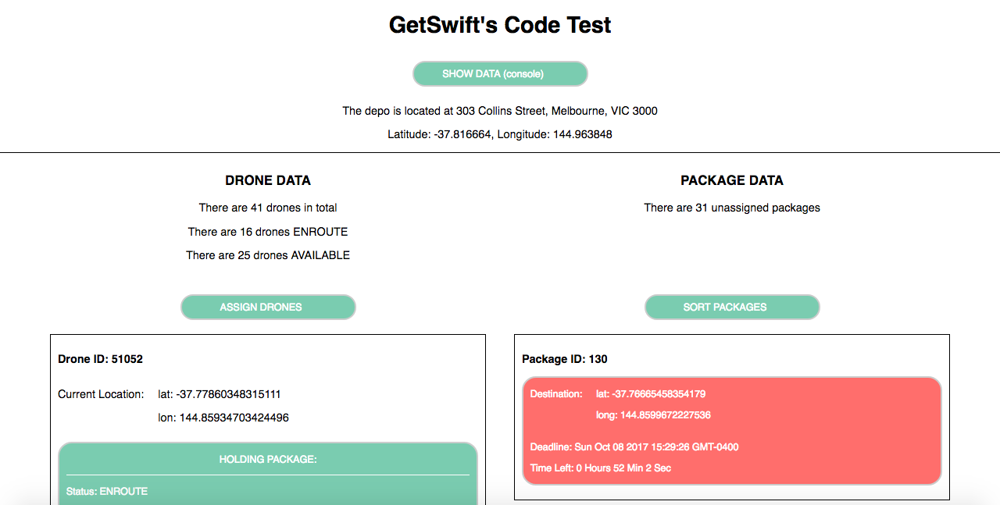
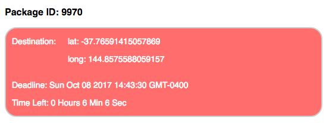
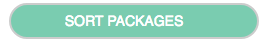
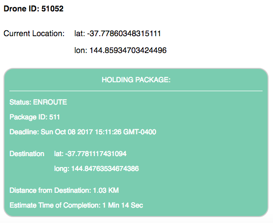
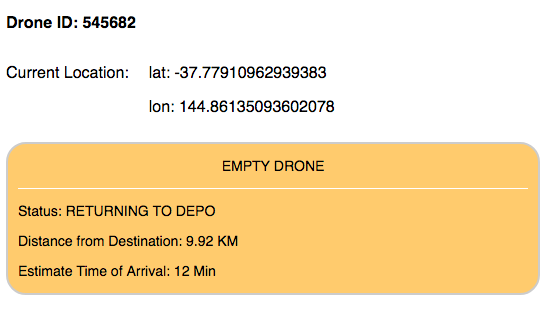
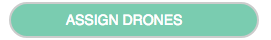
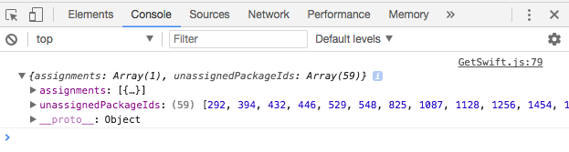

# ANALYSIS

I built a client-side app using React that makes fetch requests to the provided endpoints for drones and packages. This also allows me to conveniently display all the data on the browser with any styling that I prefer. I invested a good amount of time to first analyze the data and understand the objective at hand before I actually start coding. I personally love React and it's my choice of language for front-end apps. With the use of JSX and the virtual-DOM, it allows me to build apps that are fast and doesn't refresh on every event.

For each API, I laid out a summary of how many drones and packages there are in total. And of those drones, I have indicated how many are available for delivery (not carrying a package) and those that are already enroute to it's delivery destination. Each object is color-coated by their status.

- Assigned Drones (Green)
- Unassigned Drones (Orange)
- Unassigned Packages (Red)

## GET /packages

- Package ID
- Destination
- Deadline

Every package contains a Unix timestamp. I used this value to sort all the packages according to whichever is most urgent. I compare it with the deadline to determine the time that is left.  Each unassigned package is color coated in red.

### SORT BUTTON

The sort button sorts all the packages according to whichever is most urgent. In a real application, this button would not be necessary. All the packages would be sorted automatically in time intervals.

## GET /drones

- Drone ID
- Location
- Package Info

The drones API returns a random list of drones with their id, location and package info (if carrying). The first thing to notice is that every drone has a current location which can be compared with the location of the depo. I'm using the Haversine formula to calculate the distance between one point to another. With that, I used the amount of hours as a point of reference to determine the amount of hours, minutes and seconds that are left for the drone to reach its destination. The drones that are enroute for delivery are highlighted in green.

The formula for the time is : time = distance/speed

Each drone is either carrying a package or not. However, for each drone that does not have a package and has a current location that is different of the depo is an indication that they are on its way back to the depo. I have also calculated the time that'll take for them to reach the depo. These drones are highlighted in orange which indicates that they are available for delivery.

### ASSIGN BUTTON

The "assign" button assigns all available drone with the most urgent packages. In a real application, this button would not be necessary. All the drones would be assigned automatically in time intervals. The solution of "assignments" and "unassignedPackageIds" can then be viewed on the console.

# BUILD AND RUN THE APP

- Import/Fork the repo
- run npm install
- run npm start
